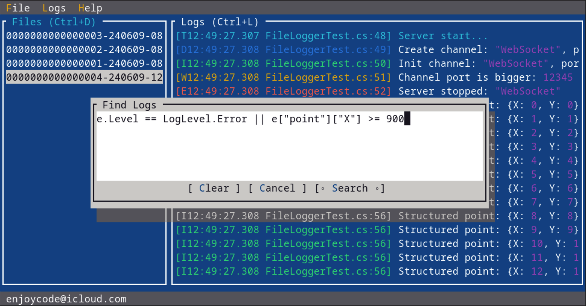

# Fast structured logger for C#

| Method       | Mean       | Error    | StdDev    | Ratio | Lock Contentions | Allocated | Alloc Ratio |
|------------- |-----------:|---------:|----------:|------:|-----------------:|----------:|------------:|
| NanoLog      |   154.6 ns |  0.91 ns |   3.48 ns |  0.04 |                - |         - |        0.00 |
| MsLog        | 3,922.2 ns | 49.13 ns | 202.60 ns |  1.00 |           0.0004 |     264 B |        1.00 |
| MsLogCodeGen | 4,079.3 ns | 52.49 ns | 218.77 ns |  1.04 |           0.0010 |     208 B |        0.79 |
