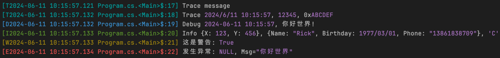

&emsp;&emsp;最近在写数据库程序，需要一个高性能的结构化日志记录组件，简单研究了一下Microsoft.Extensions.Logging和Serilog，还是决定重造一个轮子。


# 一、使用方法
&emsp;&emsp;直接参考以下示例代码:

```csharp
NanoLogger.Start();

DateTime? nullable = null;
const bool boolValue = true;
const char charValue = 'C';
const int intValue1 = 12345;
const int intValue2 = 0xABCDEF;
const string stringValue = "你好世界";
var point = new Point { X = 123, Y = 456 };
var person = new Person { Name = "Rick", Birthday = new DateTime(1977, 3, 1), Phone = "13861838709" };

var log = new NanoLogger();

log.Trace("Trace message");
log.Trace($"Trace {DateTime.Now}, {intValue1}, 0x{intValue2:X}");
log.Debug($"Debug {DateTime.Now:yyyy-MM-dd hh:mm:ss}, 你好世界!");
log.Info($"Info {point}, {person}, {charValue}");
log.Warn($"这是警告: {boolValue}");
log.Error($"发生异常: {nullable}, Msg={stringValue}");

NanoLogger.Stop();
```
执行后控制台输出如下图(记录的结构化值会高亮显示):



# 二、性能测试

&emsp;&emsp;以下测试仅用一个日期类型参数： `nanoLogger.Info($"Hello World {now}")`;

| Method       | Mean       | Error    | StdDev    | Ratio | Lock Contentions | Allocated | Alloc Ratio |
|------------- |-----------:|---------:|----------:|------:|-----------------:|----------:|------------:|
| NanoLog      |   154.6 ns |  0.91 ns |   3.48 ns |  0.04 |                - |         - |        0.00 |
| MsLog        | 3,922.2 ns | 49.13 ns | 202.60 ns |  1.00 |           0.0004 |     264 B |        1.00 |
| MsLogCodeGen | 4,079.3 ns | 52.49 ns | 218.77 ns |  1.04 |           0.0010 |     208 B |        0.79 |

* NanoLog       本组件控制台输出
* MsLog         Microsoft.Extensions.Logging控制台输出
* MsLogCodeGen  使用[LoggerMessageAttribute]代码生成方式

# 三、实现原理

```text

+-----Logger Threads-----+                               +-----Background Thread----+
|                        |                               |                          |
|   logger.Info(xxx)     |                               |    ConsoleLogger.Log()   |
|                        |      +-----Log Queue---+      |                          |
|   logger.Debug(xxx)    |  ==> |-Log-|-Log-|-...-| ==>  |    FileLogger.Log()      |
|                        |      +-----------------+      |                          |
|   logger.Warn(xxx)     |                               |    OtherLogger.Log()     |
|                        |                               |                          |
+------------------------+                               +--------------------------+
```
* 日志记录时先判断对应的日志级别是否启用，不启用直接忽略。这里使用C# 6的InterpolatedStringHandlerAttribute自定义实现LogMessageBuilder，一方面避免值类型的装箱，另一方面可以记录结构化信息（名称、类型、值、格式化）；

* 启用则将日志消息、对应的属性类型及属性值序列化后写入LogMessage内。这里的序列化非常简单，仅相当于一个内存复制（参考下图）。LogMessage是一个结构体，如果序列化后的数据小于阀值则直接存储在内置的缓冲块内（没有Heap内存分配的问题），否则从ArrayPool<byte>内租用一个缓冲块存储超出部分；
```text
+--------------------LogMessage 缓冲块-----------------------+
|-TokenType-|---Value---|-TokenType-|--------Value------|---|
|  Literal  | 5,"Hello" |   Int     | "name",12345,"X2" |   |
+-----------------------------------------------------------+
```
* 序列化后的事件信息(LogEvent)及消息数据(LogMessage)直接加入一个多生产者-单消费者的消息队列，至此前端日志记录过程结束，不阻塞后续代码执行；

* 后台线程循环从队列取出待处理日志，由配置的ILogger实现处理。例如ConsoleLogger格式化后输出至控制台；FileLogger将数据写入文件存储。

# 四、日志搜索
&emsp;&emsp;结构化日志当然得支持结构化搜索，参考控制台工程`NanoLog.File.Viewer`使用Roslyn解析字符串表达式编译后过滤日志记录（参考下图):
* 表达式中`e.XXX`对应LogEvent的相关属性条件；
* 表达式中`e["xxx"]["yyy"]`对应LogMessage结构化记录的值条件。


# 五、本文小结
&emsp;&emsp;最后GitHub地址：https://github.com/enjoycode/NanoLog.git, 作者个人能力实在有限Bug在所难免，如有问题请邮件联系或Github Issue，欢迎感兴趣的小伙伴们加入共同完善，当然更欢迎赞助项目或给作者介绍工作（目前找工作中）。
